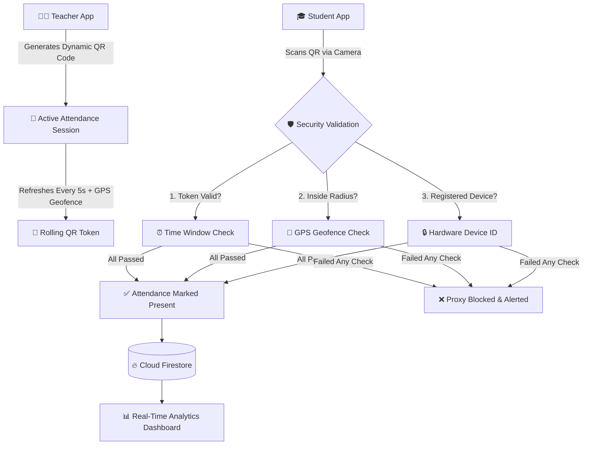

# 📱 Attendora – Smart Location-Bound QR Attendance System

[](https://flutter.dev)
[](https://dart.dev)
[](https://firebase.google.com)
[]()
[](LICENSE)

**Attendora** is an enterprise-grade, cross-platform smart attendance management application built with **Flutter** and **Firebase**. It eliminates proxy attendance using **time-bound dynamic QR codes**, **real-time GPS geofencing**, **hardware single-device locking**, and **multi-tenant role-based access control (RBAC)**.

---

## ⚡ Quick Start: How to Clone and Run Locally (TL;DR)

Want to get up and running immediately? Run these 4 commands in your terminal:

```bash
# 1. Clone the repository
git clone https://github.com/Kshitiz/Attendora-Smart-Attendance-System.git

# 2. Enter the project directory
cd Attendora-Smart-Attendance-System

# 3. Get all Flutter dependencies
flutter pub get

# 4. Run on your browser (Chrome) or connected Android device
flutter run -d chrome
```

---

## 📑 Table of Contents
- [⚡ Quick Start](#-quick-start-how-to-clone-and-run-locally-tldr)
- [📖 Detailed Local Setup Guide](#-detailed-local-setup-guide)
  - [1. Prerequisites](#1-prerequisites)
  - [2. Clone the Repository](#2-clone-the-repository)
  - [3. Install Dependencies](#3-install-dependencies)
  - [4. Firebase Setup & Configuration](#4-firebase-setup--configuration)
  - [5. Running the Application](#5-running-the-application)
  - [6. Building for Production](#6-building-for-production)
- [🌟 Key Features & Architecture](#-key-features--architecture)
- [👥 Role-Based Access Control (RBAC)](#-role-based-access-control-rbac)
- [🏗️ Project Structure](#️-project-structure)
- [🔑 Permissions](#-permissions)
- [🛠️ Tech Stack](#️-tech-stack)
- [📄 License & Contributing](#-license--contributing)

---

## 📖 Detailed Local Setup Guide

Follow this comprehensive guide to set up, configure, and run **Attendora** locally on your development environment.

### 1. Prerequisites

Before running the project, make sure you have installed:

| Tool | Recommended Version | Download / Guide |
|---|---|---|
| **Flutter SDK** | `3.3.0` or higher (channel stable) | [flutter.dev/get-started](https://docs.flutter.dev/get-started/install) |
| **Dart SDK** | Included with Flutter | Built-in |
| **Android Studio** (or VS Code) | Latest version | [developer.android.com/studio](https://developer.android.com/studio) |
| **Google Chrome** | Latest (for Web testing) | [google.com/chrome](https://www.google.com/chrome/) |
| **Firebase CLI** *(Optional)* | Latest | `npm install -g firebase-tools` |

Verify that your Flutter environment is healthy:
```bash
flutter doctor
```
*(Ensure that Flutter, Android toolchain, and Chrome checks pass without critical issues).*

---

### 2. Clone the Repository

Open your terminal or command prompt and clone the repository:

```bash
git clone https://github.com/Kshitiz/Attendora-Smart-Attendance-System.git
cd Attendora-Smart-Attendance-System
```

---

### 3. Install Dependencies

Download and link all Dart and Flutter packages declared in `pubspec.yaml`:

```bash
flutter pub get
```

---

### 4. Firebase Setup & Configuration

Attendora uses Firebase for Authentication, Cloud Firestore, and Hosting.

The project comes with a pre-configured `firebase_options.dart` and Firebase configuration files (`firebase.json`, `firestore.rules`, `firestore.indexes.json`).

> **💡 Note for Custom Firebase Projects:**
> If you want to use your own Firebase backend project:
> 1. Install FlutterFire CLI: `dart pub global activate flutterfire_cli`
> 2. Log in to Firebase: `firebase login`
> 3. Run configuration in root directory:
>    ```bash
>    flutterfire configure
>    ```
> 4. Deploy Firestore rules and indexes:
>    ```bash
>    firebase deploy --only firestore
>    ```

---

### 5. Running the Application

You can run Attendora across multiple platforms:

#### 🌐 Running on Web (Google Chrome)
```bash
# Standard Chrome web runner
flutter run -d chrome

# High-performance CanvasKit rendering engine (recommended for rich UI):
flutter run -d chrome --web-renderer canvaskit
```

#### 📱 Running on Android (Emulator or Physical Device)
1. Ensure your physical phone is connected via USB with **USB Debugging enabled**, or launch an Android Virtual Device (AVD) from Android Studio.
2. List available target devices:
   ```bash
   flutter devices
   ```
3. Run on your selected device:
   ```bash
   flutter run -d <device-id>
   # Or simply:
   flutter run
   ```

#### 🍏 Running on iOS (macOS only)
```bash
flutter run -d ios
```

#### 🖥️ Running on Desktop (Linux / macOS / Windows)
```bash
flutter run -d linux      # On Linux
flutter run -d macos      # On macOS
flutter run -d windows    # On Windows
```

---

### 6. Building for Production

#### 🌐 Build Web App:
```bash
flutter build web --release
```
*Generated output will be available in `build/web/` for deployment (Firebase Hosting, Vercel, Netlify, or Nginx).*

#### 📱 Build Android APK:
```bash
flutter build apk --release
```
*Generated APK will be located at `build/app/outputs/flutter-apk/app-release.apk`.*

#### 📦 Build Android App Bundle (AAB for Google Play Store):
```bash
flutter build appbundle --release
```

---

## 🌟 Key Features & Architecture



### 📍 1. Dynamic Rolling QR Codes
* Generates fresh QR payloads every 5 seconds with cryptographically signed timestamps.
* Prevents screenshotting, photographing, or sharing QR codes across messaging apps.

### 🛡️ 2. Hardware GPS Geofencing
* Teachers specify an allowable attendance radius (e.g., 50 meters around the lecture hall).
* Student coordinates are verified against the session anchor coordinates before marking presence.

### 🔒 3. Single-Device Hardware Binding
* Prevents "buddy punching" by associating a student's account with their device identifier.
* Multiple concurrent student logins on the same device are immediately flagged.

---

## 👥 Role-Based Access Control (RBAC)

The application provides dedicated dashboards and permissions for each role:

| Role | Key Capabilities |
|---|---|
| **👑 Super Admin** | Global system health monitoring, multi-tenant institution provisioning, system settings, global notification broadcasts, and audit logs. |
| **🏫 Institution Admin** | Department and course administration, faculty and student onboarding, schedule approvals, and batch analytics reports. |
| **👨‍🏫 Teacher** | Start dynamic QR sessions with customizable geofence radiuses, live attendee streams, manual attendance overrides, and CSV/PDF report exports. |
| **🎓 Student** | High-speed camera QR scanner with real-time GPS proximity feedback, attendance logs, monthly summaries, and subject-wise analytics. |

---

## 🏗️ Project Structure

```
Attendora/
├── android/                   # Native Android configuration & permissions
├── ios/                       # Native iOS configuration
├── web/                       # Web entrypoint, manifest & PWA service worker
├── lib/
│   ├── main.dart              # Entrypoint & Firebase initialization
│   ├── app.dart               # MaterialApp, theme configuration & router setup
│   ├── firebase_options.dart  # Firebase platform credentials & configuration
│   ├── core/                  # Design system, theme tokens, constants & router
│   │   ├── router.dart        # go_router configuration with RBAC route guards
│   │   └── theme.dart         # Attendora typography, color schemes & styles
│   └── features/              # Modular feature-driven architecture
│       ├── auth/              # Authentication flows & role switching
│       ├── super_admin/       # Super Admin dashboard, institutions & audit logs
│       ├── admin/             # Institution admin management & analytics
│       ├── teacher/           # Dynamic QR session generator & attendee stream
│       ├── student/           # Camera QR scanner & student attendance history
│       ├── attendance/        # Domain models, services & distance calculations
│       ├── institutions/      # Multi-tenant organization support
│       └── shared/            # Reusable UI widgets, cards & chart components
├── firestore.rules            # Firestore security rules with multi-tenant isolation
├── firestore.indexes.json     # Firestore composite query index definitions
├── firebase.json              # Firebase project settings & hosting config
└── pubspec.yaml               # Flutter package dependencies & asset configurations
```

---

## 🔑 Permissions

| Permission | Platforms | Reason |
|---|---|---|
| `CAMERA` | Android / iOS / Web | Real-time QR code camera scanning |
| `ACCESS_FINE_LOCATION` | Android / iOS / Web | Accurate GPS coordinates for geofence validation |
| `ACCESS_COARSE_LOCATION` | Android / iOS / Web | Approximate location fallback |
| `INTERNET` | All platforms | Real-time synchronization with Firebase Cloud Firestore |

> **⚠️ Web Permission Note:** Modern web browsers require serving over **HTTPS** (or `localhost`) to access Camera and Geolocation APIs.

---

## 🛠️ Tech Stack

* **UI Framework:** [Flutter 3.x](https://flutter.dev) & [Dart 3.x](https://dart.dev)
* **State Management:** [Riverpod](https://riverpod.dev) (`flutter_riverpod`)
* **Routing & Deep Linking:** [GoRouter](https://pub.dev/packages/go_router)
* **Backend & Auth:** [Firebase Authentication](https://firebase.google.com/products/auth) & [Cloud Firestore](https://firebase.google.com/products/firestore)
* **QR Scanning & Generation:** [`mobile_scanner`](https://pub.dev/packages/mobile_scanner) & [`qr_flutter`](https://pub.dev/packages/qr_flutter)
* **Geolocation & Geofencing:** [`geolocator`](https://pub.dev/packages/geolocator)
* **Analytics & Visualizations:** [`fl_chart`](https://pub.dev/packages/fl_chart)
* **Device Security:** [`device_info_plus`](https://pub.dev/packages/device_info_plus) & [`flutter_secure_storage`](https://pub.dev/packages/flutter_secure_storage)

---

## 📄 License & Contributing

* **License:** Distributed under the MIT License. See [LICENSE](LICENSE) for more details.
* **Contributing:** Issues, ideas, and pull requests are welcomed! Visit the [Issues Tab](https://github.com/Kshitiz/Attendora-Smart-Attendance-System/issues) to report bugs or request features.
