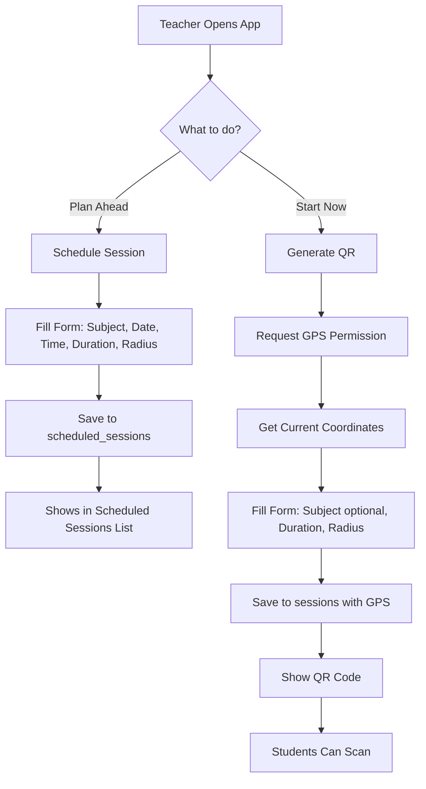

# Schedule Session vs Start Session - Clear Separation

## Visual Comparison

### SCHEDULE SESSION (Planning Phase)
```
┌───────────────────────────────────────────────────┐
│  📅 Schedule Session                              │
│  Plan sessions in advance.                        │
│  Location will be captured when you start         │
└───────────────────────────────────────────────────┘

┌─────────────────────────────────────────────────┐
│  Session Details                                │
│                                                 │
│  📚 Subject/Class Name                          │
│  ┌─────────────────────────────────────────┐   │
│  │ Mathematics 101                         │   │
│  └─────────────────────────────────────────┘   │
│                                                 │
│  📅 Date            ⏰ Time                     │
│  ┌──────────────┐  ┌──────────────┐           │
│  │ Nov 15, 2025 │  │ 2:00 PM      │           │
│  └──────────────┘  └──────────────┘           │
│                                                 │
│  ⏱️ Duration        📡 Radius                   │
│  ┌──────────────┐  ┌──────────────┐           │
│  │ 60 minutes   │  │ 50 meters    │           │
│  └──────────────┘  └──────────────┘           │
│                                                 │
│  🚫 NO LOCATION FIELD                          │
│  (Will be captured via GPS when starting)      │
│                                                 │
│  ┌─────────────────────────────────────────┐   │
│  │  ➕ Schedule Session                    │   │
│  └─────────────────────────────────────────┘   │
└─────────────────────────────────────────────────┘
```

### GENERATE QR (Execution Phase)
```
┌───────────────────────────────────────────────────┐
│  📲 Generate Attendance QR                        │
│  Start a new attendance session                   │
└───────────────────────────────────────────────────┘

┌─────────────────────────────────────────────────┐
│  📚 Subject/Class (optional)                    │
│  ┌─────────────────────────────────────────┐   │
│  │ Mathematics 101                         │   │
│  └─────────────────────────────────────────┘   │
│                                                 │
│  ⏱️ Duration (minutes)                          │
│  ┌─────────────────────────────────────────┐   │
│  │ 10                                      │   │
│  └─────────────────────────────────────────┘   │
│                                                 │
│  📡 Geofence Radius (meters)                    │
│  ┌─────────────────────────────────────────┐   │
│  │ 50                                      │   │
│  └─────────────────────────────────────────┘   │
│                                                 │
│  ✅ LOCATION CAPTURED VIA GPS                  │
│  📍 Automatically gets your coordinates         │
│                                                 │
│  ┌─────────────────────────────────────────┐   │
│  │  🚀 Start Session                       │   │
│  └─────────────────────────────────────────┘   │
└─────────────────────────────────────────────────┘
```

## Data Flow Diagram

```
┌──────────────────────┐
│  TEACHER PLANNING    │
│  (Schedule Session)  │
└──────────┬───────────┘
           │
           │ Saves to Firestore:
           │ - teacherUid
           │ - subject
           │ - scheduledFor (timestamp)
           │ - duration
           │ - radiusMeters
           │ ❌ NO location
           ↓
  ┌────────────────────┐
  │ scheduled_sessions │
  │    collection      │
  └────────┬───────────┘
           │
           │ When time arrives...
           ↓
┌──────────────────────┐
│  TEACHER EXECUTION   │
│  (Generate QR)       │
└──────────┬───────────┘
           │
           │ 1. Requests GPS location
           │ 2. Gets coordinates
           │ 3. Creates active session
           ↓
  ┌────────────────────┐
  │     sessions       │
  │   collection       │
  │                    │
  │ ✅ HAS location:   │
  │   - latitude       │
  │   - longitude      │
  └────────┬───────────┘
           │
           │ Students scan QR
           ↓
┌──────────────────────┐
│  STUDENT ATTENDANCE  │
│  (Scan QR)           │
└──────────────────────┘
  Verifies student is within
  radius of teacher's GPS
  coordinates
```

## Why This Separation?

### Schedule Session (Planning)
**Purpose:** Plan ahead, set expectations

**Captures:**
- What (subject)
- When (date/time)
- How long (duration)
- How far (radius)

**Does NOT Capture:**
- Where (location) - because teacher might not be there yet!

**Use Case:**
> "I'll have Math 101 next Tuesday at 2 PM, 60 minutes, students must be within 50 meters"

### Generate QR (Execution)
**Purpose:** Start the actual session, verify presence

**Captures:**
- Where (GPS coordinates) - verified in real-time
- What (subject - can override)
- How long (duration - can override)
- How far (radius - can override)

**Use Case:**
> "I'm now in the classroom, starting the session. My GPS confirms I'm at the location."

## Student Verification

```
Student's Phone
      ↓
  Scans QR Code
      ↓
Gets Teacher's GPS Coordinates from Session
      ↓
  Gets Own GPS Location
      ↓
Calculates Distance
      ↓
  Distance ≤ Radius?
      ↓
   YES → ✅ Attendance Marked
    NO → ❌ "You're too far from the session"
```

## Real-World Example

### Morning Planning (Schedule Session):
```
8:00 AM - Teacher at home
"I need to schedule my classes for today"

Schedule:
- Math 101 at 10:00 AM, 60 min, 50m radius
- Physics Lab at 2:00 PM, 90 min, 100m radius

✅ Scheduled successfully
```

### Class Time (Generate QR):
```
9:55 AM - Teacher arrives at classroom
"Time to start Math 101"

Generate QR:
- Subject: Math 101 (pre-filled from schedule)
- Duration: 60 minutes (pre-filled)
- Radius: 50 meters (pre-filled)
- 📍 GPS: 40.7128° N, 74.0060° W (CAPTURED NOW)

✅ Session started at actual location
```

### Student Attendance (Scan QR):
```
10:02 AM - Student in classroom

Scans QR Code:
- Gets teacher's coordinates
- Checks own GPS location
- Distance: 15 meters ✅
- Attendance marked!

Student outside (100m away):
- Distance: 100 meters ❌
- "You're too far from the session location"
```

## Key Benefits

### 1. Flexibility
- Schedule in advance, even from home
- Don't need to be at location to plan
- Can schedule entire week on Sunday

### 2. Security
- Real-time location verification
- Teacher must be physically present to start
- Students must be within geofence

### 3. Accuracy
- No manual location entry errors
- GPS provides exact coordinates
- Automated distance calculation

### 4. Simplicity
- Schedule = Simple planning form
- Start = One-tap with GPS capture
- Clear separation of concerns

## Common Questions

### Q: Why not ask for location when scheduling?
**A:** Because the teacher might be at home or somewhere else when scheduling classes for the next day/week. The actual classroom location is captured via GPS when they physically start the session.

### Q: What if I schedule from the classroom?
**A:** No problem! The schedule is just for planning. When you start the session via Generate QR, your GPS location is captured at that moment, wherever you are.

### Q: Can I edit a scheduled session?
**A:** Currently you can delete and recreate. Future versions may add edit functionality.

### Q: Does the scheduled session auto-start?
**A:** No. You must manually go to Generate QR to start the session. This ensures you're physically present and the GPS location is accurate.

### Q: What if I'm late to my scheduled session?
**A:** No problem! Scheduled sessions are just reminders. You start the actual session via Generate QR whenever you arrive.

## Summary Table

| Feature | Schedule Session | Generate QR (Start) |
|---------|------------------|---------------------|
| **When** | Days/hours before | Right now |
| **Where** | Anywhere | Must be at location |
| **Location** | Not captured | GPS coordinates |
| **Purpose** | Planning | Execution |
| **Duration** | User input | User input |
| **Radius** | User input | User input |
| **Required** | Subject, Date/Time | Location (GPS) |
| **Optional** | All fields editable | Subject override |
| **Creates** | scheduled_sessions doc | sessions doc |
| **Students** | Cannot interact | Can scan & attend |

## Technical Flow



## Best Practices

### For Teachers:
1. ✅ Schedule sessions in advance for better organization
2. ✅ Use Generate QR when you're physically at the location
3. ✅ Verify your GPS is enabled before starting session
4. ✅ Use consistent naming for subjects

### For Students:
1. ✅ Ensure GPS is enabled on your device
2. ✅ Be physically present in the classroom
3. ✅ Scan within the designated radius
4. ✅ Scan when teacher confirms session is active

## Conclusion

The separation between scheduling and starting sessions ensures:
- 🎯 **Accurate location tracking** via GPS
- 📅 **Flexible planning** from anywhere
- 🔒 **Security** through presence verification
- 🚀 **Simple UX** with clear purposes
- ⚡ **Fast loading** without complex indexes

